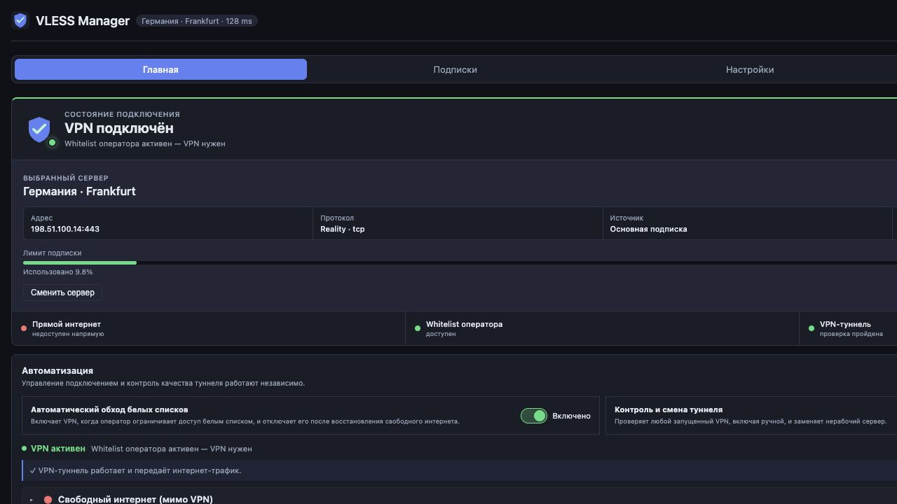

# VLESS Manager

[](https://github.com/wad350/vless-manager/actions/workflows/ci.yml)
[](https://github.com/wad350/vless-manager/releases/latest)

VLESS Manager — менеджер прозрачного VPN для Keenetic с Entware. Он направляет
трафик самого роутера и устройств локальной сети через VLESS, управляет
подписками, выбирает рабочий сервер, контролирует туннель и оставляет выбранные
домены вне VPN.



## Возможности

- прозрачный TUN-туннель для роутера и клиентов LAN;
- встроенный официальный sing-box без отдельного процесса;
- VLESS Reality/TLS с транспортами TCP, WebSocket, gRPC, HTTP/H2,
  HTTP Upgrade и QUIC;
- несколько подписок, приоритеты, отключение подписок и отдельных серверов;
- проверка каждого включённого сервера реальным HTTP-запросом через туннель;
- выбор быстрейшего узла в приоритетной подписке или среди всех подписок;
- независимое автоматическое включение VPN при whitelist оператора;
- независимый health-check и замена неработающего туннеля;
- Bypass для российского списка и пользовательских доменов;
- график общего, VPN- и Bypass-трафика в битах в секунду;
- структурированный журнал manager и sing-box;
- проверка и установка новых версий из GitHub Releases через WebUI;
- автономный IPK: `iptables` включён в пакет для установки без доступа к
  репозиторию Entware.

Подробное описание интерфейса, логики и диагностики:
**[Руководство пользователя](docs/USER_GUIDE.md)**.

## Требования

- Keenetic OS с установленным Entware;
- архитектура `mipsel-3.4` (проверенная платформа: MT7621);
- интерфейс LAN `br0`;
- Go `1.24.7` для сборки;
- `sshpass`, если используется автоматическая установка из Makefile.

Проект настроен под конкретную схему Keenetic/Entware. Установка на другую
архитектуру или OpenWrt требует проверки имён интерфейсов и правил policy
routing.

## Сборка

```sh
make ipk
```

Готовый пакет появится в `build/`. В бинарник встраиваются WebUI и sing-box
`v1.13.14`; отдельный пакет sing-box не требуется.

## Установка

Готовый IPK для Keenetic доступен на странице
**[Releases](https://github.com/wad350/vless-manager/releases/latest)**.
Для быстрой установки или обновления выполните на роутере от `root`:

```sh
curl -fsSL https://raw.githubusercontent.com/wad350/vless-manager/main/install.sh | sh
```

Установщик поддерживает также `wget`, проверяет архитектуру Entware и SHA-256,
после чего устанавливает последний стабильный IPK через `opkg`. Чтобы установить
конкретную версию:

```sh
curl -fsSL https://raw.githubusercontent.com/wad350/vless-manager/main/install.sh | \
  VLESS_MANAGER_VERSION=1.15.5 sh
```

При установке скачанного IPK вручную:

```sh
opkg install /tmp/vless-manager_VERSION_mipsel-3.4.ipk
```

Для сборки и установки из исходного дерева пароль роутера не хранится в
репозитории и передаётся только при вызове:

```sh
make install-ipk PASS='router-password'
```

По умолчанию используется `root@192.168.201.1:222`. Другой адрес:

```sh
make install-ipk \
  ROUTER='root@router-address' \
  PORT='222' \
  PASS='router-password'
```

После установки:

- WebUI: `http://router-address:3001`;
- конфигурация: `/opt/etc/vless-manager/`;
- журнал процесса: `/opt/var/log/vless-manager.log`;
- управление сервисом:

```sh
/opt/etc/init.d/S99vless-manager status
/opt/etc/init.d/S99vless-manager restart
/opt/etc/init.d/S99vless-manager stop
```

## Разработка

```sh
GOCACHE="$PWD/.gocache" GOTOOLCHAIN=go1.24.7 \
  go test -tags with_utls ./cmd/vless-manager
```

Основные каталоги:

- `cmd/vless-manager/` — менеджер, API, маршрутизация и WebUI;
- `singbox_src/` — зафиксированный исходный код sing-box;
- `packaging/` — сборка пакетов Entware/OpenWrt и init-скрипты;
- `docs/` — пользовательская документация.

Push и pull request запускают тесты и сборку MIPSLE-бинарника. Тег формата
`vX.Y.Z`, совпадающий с `VERSION` в `Makefile`, создаёт GitHub Release с
IPK-пакетом и SHA-256.

## Обновление

В **Настройки → Система** можно проверить и установить последнюю версию.
Если VPN запущен, GitHub API и release asset сначала загружаются через
VPN-туннель. При выключенном или неработающем VPN используется прямое
WAN-соединение.

Во время установки WebUI показывает текущий этап, общий процент, объём,
скорость и выбранный маршрут. После перезапуска страница сама восстанавливает
соединение и подтверждает фактически запущенную версию.

Перед установкой менеджер проверяет имя release asset, размер, SHA-256,
метаданные IPK и архитектуру вложенного бинарника. Пакет устанавливается через
`opkg install --force-reinstall`; результат установки и запуска записывается в
отдельный журнал обновления.

## Ограничения

- XHTTP намеренно не поддерживается: используется официальный sing-box, а
  XHTTP-узлы исключаются при разборе подписки.
- TUN MTU зафиксирован на `1500`.
- процесс ограничен тремя потоками Go и мягким лимитом памяти 50 MiB, чтобы
  оставить ресурсы Keenetic OS;
- UDP/443 блокируется в таблице маршрутизации, чтобы клиенты откатывались с
  QUIC на TCP и не создавали чрезмерную нагрузку на роутер.

## Безопасность

Не коммитьте `config.json`, `subscriptions.json`, ссылки подписок, UUID и
пароли роутера. Локальные runtime-файлы исключены через `.gitignore`.
