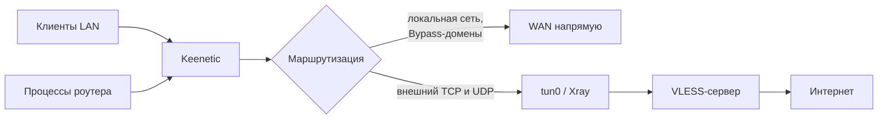
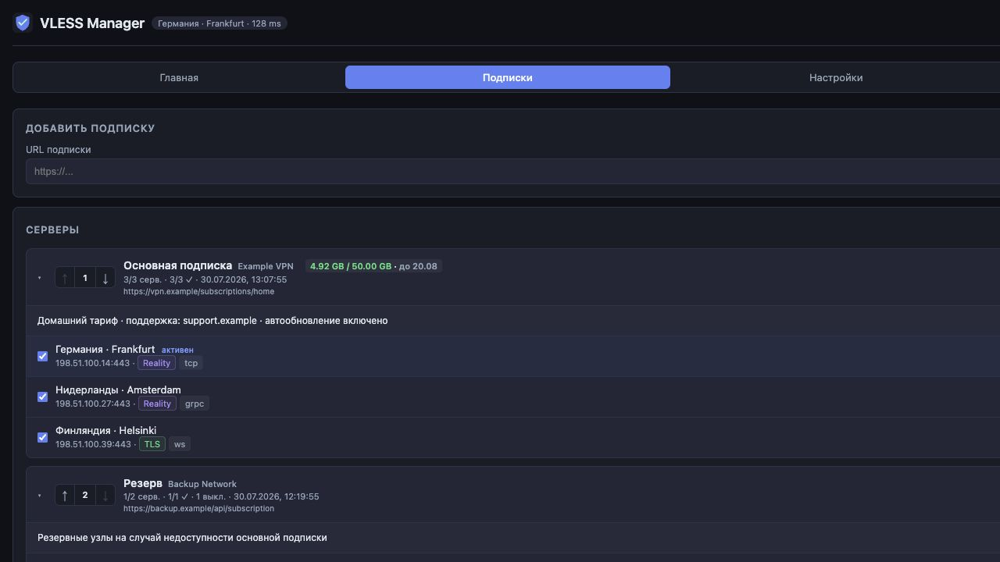
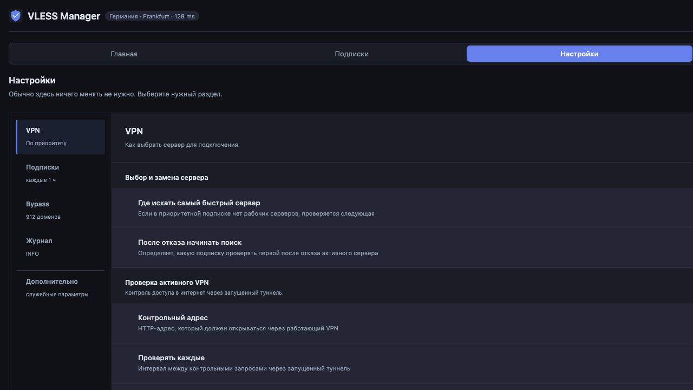
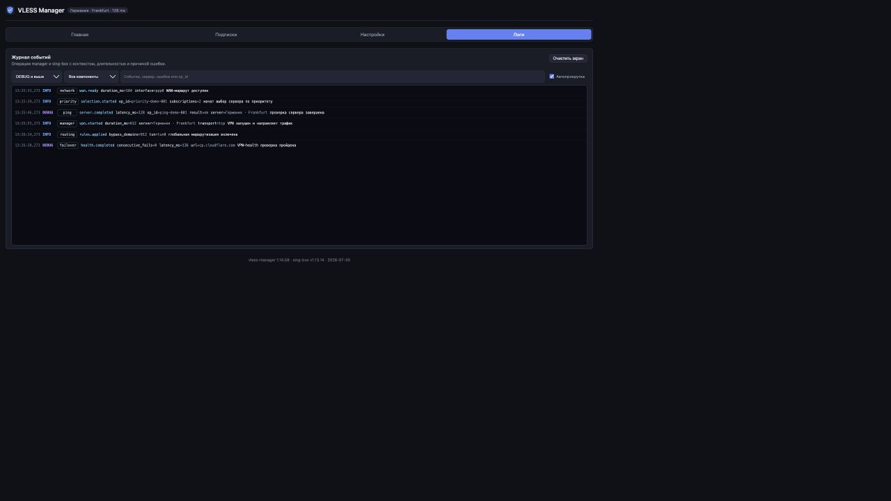

# Руководство VLESS Manager

## Назначение

VLESS Manager превращает Keenetic с Entware в прозрачный VPN-шлюз. Приложения
на телефонах, компьютерах и самом роутере не нужно настраивать отдельно:
маркировка пакетов и policy routing направляют основной трафик в `tun0`.



В текущей сборке Xray встроен в процесс менеджера. Это экономит память и
позволяет получать отдельные счётчики для VPN и Bypass без второго демона.

## Главная


Верхняя карточка показывает:

- запущен ли VPN;
- имя, адрес, протокол и источник активного сервера;
- последний известный HTTP-пинг;
- время работы туннеля;
- квоту и срок подписки, если провайдер передал
  `subscription-userinfo`;
- состояние прямого интернета, whitelist оператора и VPN-health.

Кнопка **Запустить VPN** сначала проверяет все включённые серверы, которые
нужны выбранной стратегии, и только после полного прохода подключает
подходящий узел. Кнопка **Сменить сервер** открывает список подписок.

### Два независимых автомата

**Автоматический обход белых списков** отвечает только за необходимость VPN.
Проверки прямого интернета выполняются всегда. Переключатель разрешает
менеджеру менять состояние VPN по их результату:

| Свободный интернет | Whitelist | Решение |
|---|---|---|
| доступен | любое состояние | VPN не нужен |
| недоступен | доступен | оператор ограничил доступ, VPN нужен |
| недоступен | недоступен | связи нет, запуск VPN не решает проблему |

**Контроль и смена туннеля** отвечает за качество уже запущенного VPN, в том
числе включённого вручную. После заданного числа ошибок VPN-health менеджер
проверяет связь оператора и ищет замену. Этот автомат можно оставить
включённым при выключенном автоматическом обходе whitelist.

### График трафика

Переключатель над графиком выбирает источник:

- **Весь** — трафик интерфейса LAN;
- **VPN** — байты, прошедшие через outbound `proxy`;
- **Bypass** — байты, прошедшие через outbound `direct`.

Скорость отображается в `Кбит/с` и `Мбит/с`, объём — в байтах, MiB и GiB.
Режимы VPN и Bypass доступны только при работающем туннеле. После перезапуска
процесса история графика начинается заново.

## Подписки



### Добавление и обновление

Вставьте URL и при необходимости задайте локальное название. Менеджер
понимает:

- обычный список ссылок `vless://`;
- Base64-кодированный список;
- JSON-конфигурацию Xray с VLESS outbound;
- Clash/Mihomo YAML с VLESS proxy;
- ответы провайдера с именем, описанием, квотой и сроком действия.

Для каждого роутера создаётся постоянный локальный идентификатор клиента. Он
передаётся при загрузке подписок, поэтому парк роутеров не использует один и
тот же ID. Сам URL подписки при этом не изменяется.

Автообновление загружает все включённые подписки с заданным интервалом. Если
включён пункт **Обновлять подписки через работающий VPN-туннель**, туннель
используется только после успешного VPN-health; иначе запрос идёт напрямую.

Обновление не должно останавливать работающий VPN только из-за изменения
каталога. Активная конфигурация продолжает работать до явной замены или
остановки. Удаление подписки также не обрывает уже запущенный туннель.

### Приоритеты

Стрелки рядом с номером меняют порядок подписок. Выключенная подписка целиком
исключается из проверки и выбора. Галка у сервера исключает только этот узел;
неудачный пинг сам по себе галку не снимает.

Доступны две стратегии:

- **В приоритетной подписке** — ищется сервер с минимальной задержкой в первой
  подписке, где есть рабочие узлы. Если рабочих узлов нет, проверяется
  следующая подписка.
- **Во всех подписках** — проверяются все включённые узлы и выбирается
  минимальная задержка независимо от приоритета.

При отказе активного сервера поиск можно начинать с его текущей подписки или
с первой подписки в списке.

### Проверка серверов

Это не ICMP ping. Для каждого узла менеджер:

1. создаёт временную конфигурацию Xray;
2. поднимает локальный SOCKS listener;
3. устанавливает VLESS-туннель;
4. отправляет HTTP-запрос на контрольный URL;
5. сохраняет задержку или причину ошибки.

Такой тест проверяет не только доступность IP и порта, но и TLS/Reality,
транспорт, авторизацию и передачу интернет-трафика.

Число одновременных проверок задаётся в служебных настройках. Значение `1`
включает последовательный режим, большее значение проверяет узлы параллельно.
Менеджер применяет указанное значение без скрытого ограничения по CPU или RAM.

Результаты записываются в `ping-cache.json` и отображаются после перезагрузки
страницы. Перед обычным запуском выполняется свежий полный проход; только что
завершённый идентичный проход может быть переиспользован.

### Поддерживаемые узлы

Используется VLESS с Reality, TLS или без TLS. Поддерживаемые транспорты:
`tcp`, `ws`, `grpc`, `httpupgrade` и `xhttp`. QUIC как VLESS-транспорт не
поддерживается новым ядром; обычный UDP/443 передаётся через VLESS/XUDP.
XHTTP обслуживает встроенный Xray core.

Другие протоколы и неподдерживаемые транспорты не попадают в рабочий каталог.

## Настройки



Настройки сгруппированы по задачам.

### Доступ

По умолчанию панель доступна без входа, как и в предыдущих версиях. Опция
**Требовать вход** закрывает WebUI и все рабочие API-методы авторизацией по
учётной записи панели управления Keenetic.

- пароль проверяет сам Keenetic и VLESS Manager его не сохраняет;
- сессия автоматически продлевается при активной работе;
- после пяти неверных попыток вход временно блокируется;
- кнопка **Выйти** завершает текущую сессию на этом устройстве.

Срок сессии задаётся в часах. После перезапуска VLESS Manager активные сессии
сбрасываются, поэтому потребуется войти снова.

### VPN

- область поиска самого быстрого сервера;
- начальная подписка при failover;
- URL, интервал и таймаут VPN-health;
- число ошибок перед заменой;
- пауза между повторными попытками.

### Подписки

- период автоматического обновления;
- загрузка через проверенный VPN-туннель.

### Bypass

- встроенный список российских банков, Госуслуг, Mail.ru, VK, Яндекса и CDN;
- дополнительные домены, по одному в строке;
- ручное обновление готового списка.

Запись `example.com` действует как `domain_suffix` и охватывает
`www.example.com`, `api.example.com` и другие поддомены.

### Журнал

Отдельно задаётся подробность VLESS Manager и Xray:

- `ERROR` — только ошибки;
- `WARN` — ошибки и предупреждения;
- `INFO` — обычные операции и итоговые решения;
- `DEBUG` — этапы проверок, загрузок и выбора;
- `TRACE` — максимальная детализация.

Для постоянной работы рекомендуется `INFO` у менеджера и `ERROR` у Xray.
На время диагностики обычно достаточно `DEBUG`.

### Система

Раздел показывает установленную и последнюю опубликованную версии:

1. **Проверить** запрашивает последний GitHub Release.
2. Если VPN запущен, запрос и загрузка сначала идут через его локальный
   SOCKS-вход. При недоступности туннеля менеджер повторяет операцию напрямую.
3. **Установить обновление** запускает фоновую загрузку IPK-пакета и отдельного
   файла SHA-256.
4. Центр обновления показывает этапы, общий процент, загруженный объём,
   скорость и фактически выбранный маршрут.
5. Менеджер проверяет контрольную сумму, метаданные IPK и архитектуру
   вложенного бинарника, затем передаёт пакет `opkg`. Страница ожидает
   перезапуска и подтверждает новую версию.
6. Результат `opkg` и последующего запуска сохраняется в журнале обновления.

Подписки, настройки, кэш пинга и bypass при обновлении не удаляются. Установка
начинается только после явного подтверждения пользователя.

### Дополнительно

Раздел содержит таймеры автоматики, контрольные адреса, лимит параллельных
проверок, ожидание WAN и сетевые таймауты. Менять их следует только при
понятной диагностической причине. Кнопка **По умолчанию** сбрасывает только
текущий раздел, а изменения применяются после **Сохранить**.

## Журнал и диагностика



Запись содержит время, уровень, компонент, событие, поля контекста и
читаемое сообщение. Основные компоненты:

- `manager` — запуск и остановка VPN, конфигурация;
- `network` — WAN и состояние интерфейсов;
- `routing` — iptables, policy routing и `tun0`;
- `subscription` — загрузка и разбор подписок;
- `ping` — тесты серверов;
- `priority` — порядок обхода подписок и выбор;
- `failover` — решения автоматики и VPN-health;
- `bypass` — обновление и применение прямых доменов;
- `update` — проверка релиза, выбранный сетевой маршрут и установка;
- `auth` — успешные и неуспешные попытки входа без паролей и токенов;
- `Xray` — сообщения сетевого движка.

`op_id` связывает начало, промежуточные события и итог одной операции.
Фильтры позволяют выбрать минимальный уровень, компонент или найти сервер,
ошибку и `op_id`.

### Нет интернета после запуска

1. Проверьте карточки **VPN-туннель** и **Маршрутизация**.
2. В логах выберите `routing`, затем `Xray`.
3. Убедитесь, что существуют `tun0`, таблица `100` и цепочка
   `VLESS_TPROXY`.
4. Проверьте, что активный сервер не отключён и поддерживается текущей
   сборкой.

```sh
ip addr show tun0
ip rule show
ip route show table 100
iptables -t mangle -S VLESS_TPROXY
```

### Высокая нагрузка

Сначала определите виновника через `top`/`htop`. VLESS Manager использует все
доступные Go-планировщику CPU и не задаёт искусственный лимит памяти. Число
параллельных проверок применяется из настройки без аппаратного ограничителя.
При этом Xray встроен в тот же процесс, а тяжёлые операции выполняются
через единую очередь, чтобы они не меняли общую конфигурацию одновременно.

Большой load average на Keenetic может создавать `ndm` в состоянии `D`, а не
сам VPN. Сопоставляйте load average с CPU, I/O wait и журналом операций.

### Подписка не добавляется

На уровне `DEBUG` журнал показывает размер ответа, формат и причину отказа.
Проверьте:

- доступность URL напрямую и через VPN;
- что ответ содержит VLESS, а не HTML-страницу/капчу;
- что провайдер принимает User-Agent клиента;
- что после фильтрации остался хотя бы один поддерживаемый узел.

### Туннель не меняется

Проверьте, что включён **Контроль и смена туннеля**, VPN-health выполнил
достаточное число попыток, а backoff предыдущего запуска завершён. Затем
отфильтруйте журнал по `failover`, `priority` и общему `op_id`.

## Маршрутизация

Менеджер создаёт `tun0`, маркирует трафик LAN и роутера и направляет его в
таблицу `100`. Исключения:

- private/LAN сети;
- DNS роутера;
- IP активного VLESS-сервера;
- health-check и временные проверки менеджера;
- Bypass-домены.

Внешние TCP и UDP проходят через VLESS. Это включает DNS к публичным
резолверам и QUIC (UDP/443). DNS-запросы к LAN-адресу самого Keenetic остаются
локальными и обслуживаются его DNS-службой.

Init-скрипт очищает текущие и устаревшие правила при старте и остановке. После
аварийного завершения достаточно перезапустить сервис:

```sh
/opt/etc/init.d/S99vless-manager restart
```

## Ресурсы и ограничения платформы

Пакеты собираются для Keenetic OS с Entware `mipsel-3.4` на MT7621 и
`aarch64-3.10` на ARM64. Миграцию Xray на роутере следует проверять отдельно.

- TUN MTU фиксирован на `1500`;
- Go toolchain фиксирован на `1.27.1`;
- Xray фиксирован на prerelease `v26.9.9` с локальными исправлениями;
- бинарник не сжимается UPX: на MT7621 такой бинарник аварийно завершался;
- лимит открытых файлов процесса повышается до `65536`;
- `/proc/sys/fs/file-max` повышается до `131072`;
- XHTTP обслуживается встроенным Xray.

Перед миграцией менеджер сохраняет `config.json.before-xray` и
`subscriptions.json.before-xray` в том же каталоге для восстановления каталога
узлов, если часть старых транспортов не поддерживается Xray.

## Файлы на роутере

| Путь | Назначение |
|---|---|
| `/opt/bin/vless-manager` | исполняемый файл |
| `/opt/etc/vless-manager/config.json` | конфигурация и настройки |
| `/opt/etc/vless-manager/subscriptions.json` | подписки и ручные исключения |
| `/opt/etc/vless-manager/ping-cache.json` | сохранённые результаты тестов |
| `/opt/etc/vless-manager/device-hwid` | постоянный ID этого роутера |
| `/opt/var/log/vless-manager.log` | stdout/stderr процесса |
| `/opt/var/log/vless-manager-update.log` | установка и откат обновления |
| `/opt/etc/init.d/S99vless-manager` | управление сервисом и очистка маршрутов |

Файлы подписок и конфигурации содержат секреты. Не публикуйте их в issue,
скриншотах или репозитории.
